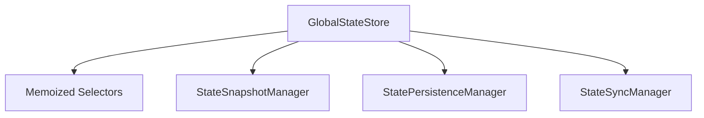

# State Management Architecture - Architecture Blueprint

```mermaid
graph TD
  Store[GlobalStateStore] --> Selectors[Memoized Selectors]
  Store --> Snapshots[StateSnapshotManager]
  Store --> Persistence[StatePersistenceManager]
  Store --> Sync[StateSyncManager]
```
