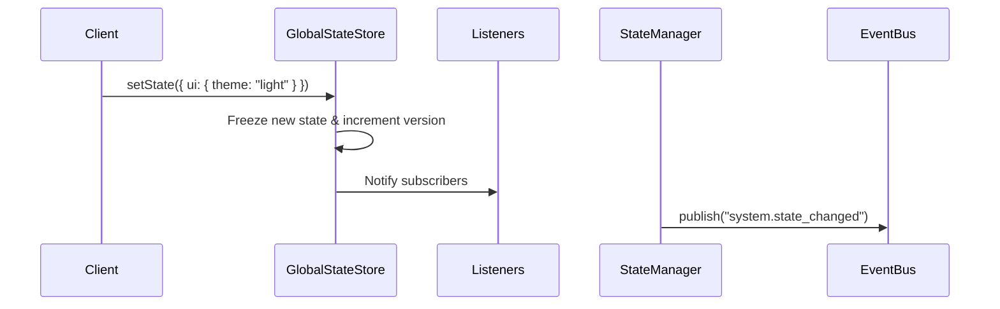

# State Management Architecture - Sequence Diagram

```mermaid
sequenceDiagram
  Client->>GlobalStateStore: setState({ ui: { theme: "light" } })
  GlobalStateStore->>GlobalStateStore: Freeze new state & increment version
  GlobalStateStore->>Listeners: Notify subscribers
  StateManager->>EventBus: publish("system.state_changed")
```
