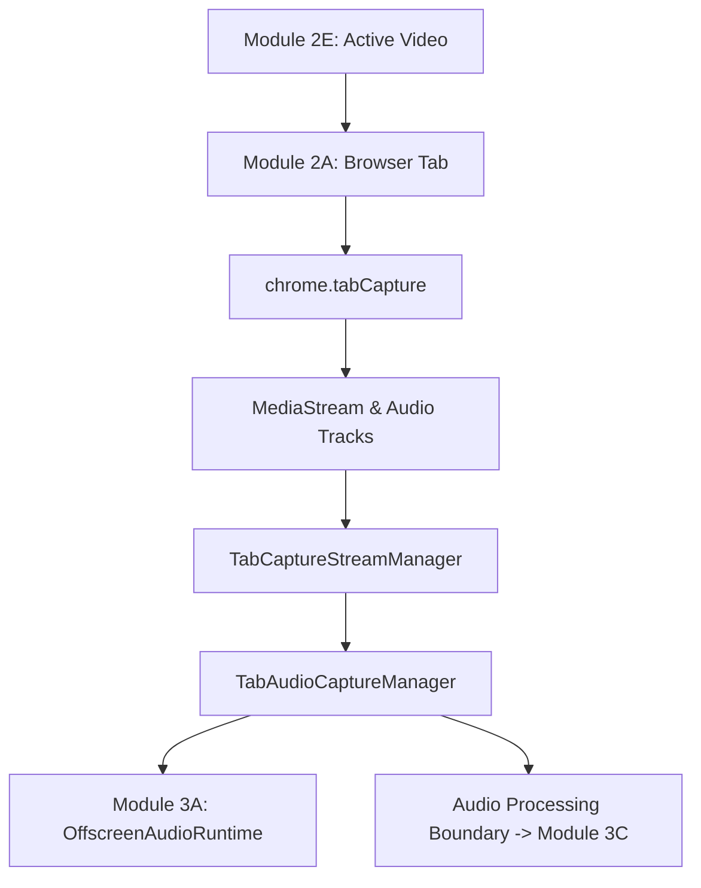

# Real-Time Tab Audio Capture Engine - Architecture Blueprint

```mermaid
graph TD
  ActiveVideo[Module 2E: Active Video] --> Tab[Module 2A: Browser Tab]
  Tab --> TabCapture[chrome.tabCapture]
  TabCapture --> Stream[MediaStream & Audio Tracks]
  Stream --> StreamManager[TabCaptureStreamManager]
  StreamManager --> Manager[TabAudioCaptureManager]
  Manager --> Offscreen[Module 3A: OffscreenAudioRuntime]
  Manager --> Boundary[Audio Processing Boundary -> Module 3C]
```
