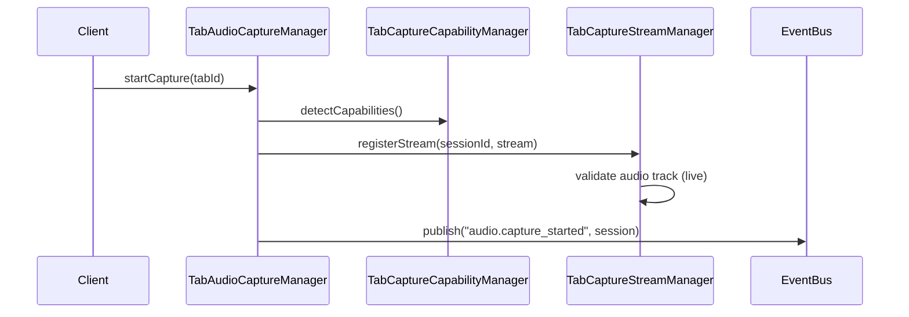

# Real-Time Tab Audio Capture Engine - Sequence Diagram

```mermaid
sequenceDiagram
  Client->>TabAudioCaptureManager: startCapture(tabId)
  TabAudioCaptureManager->>TabCaptureCapabilityManager: detectCapabilities()
  TabAudioCaptureManager->>TabCaptureStreamManager: registerStream(sessionId, stream)
  TabCaptureStreamManager->>TabCaptureStreamManager: validate audio track (live)
  TabAudioCaptureManager->>EventBus: publish("audio.capture_started", session)
```
