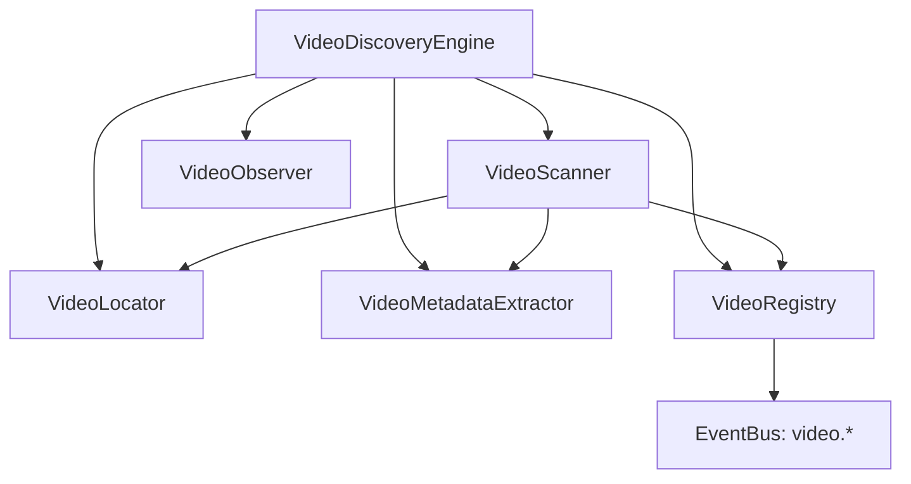

# Video Discovery Engine - Architecture Blueprint

```mermaid
graph TD
  VDE[VideoDiscoveryEngine] --> Locator[VideoLocator]
  VDE --> Extractor[VideoMetadataExtractor]
  VDE --> Registry[VideoRegistry]
  VDE --> Scanner[VideoScanner]
  VDE --> Observer[VideoObserver]
  Scanner --> Locator
  Scanner --> Extractor
  Scanner --> Registry
  Registry --> EB[EventBus: video.*]
```
