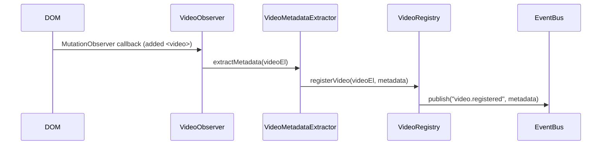

# Video Discovery Engine - Sequence Diagram

```mermaid
sequenceDiagram
  DOM->>VideoObserver: MutationObserver callback (added <video>)
  VideoObserver->>VideoMetadataExtractor: extractMetadata(videoEl)
  VideoMetadataExtractor->>VideoRegistry: registerVideo(videoEl, metadata)
  VideoRegistry->>EventBus: publish("video.registered", metadata)
```
