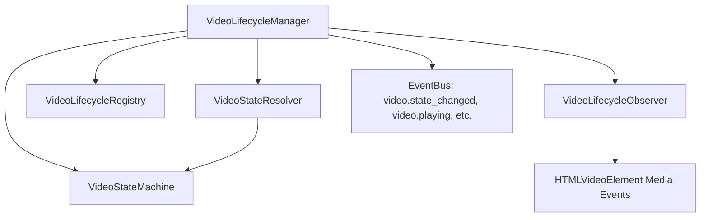

# Video Lifecycle Manager - Architecture Blueprint

```mermaid
graph TD
  VLM[VideoLifecycleManager] --> VSM[VideoStateMachine]
  VLM --> VSR[VideoStateResolver]
  VLM --> VLR[VideoLifecycleRegistry]
  VLM --> VLO[VideoLifecycleObserver]
  VLO --> DOM[HTMLVideoElement Media Events]
  VSR --> VSM
  VLM --> EB[EventBus: video.state_changed, video.playing, etc.]
```
