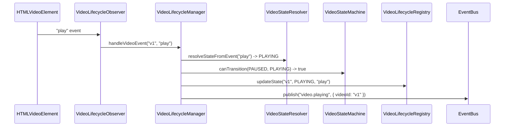

# Video Lifecycle Manager - Sequence Diagram

```mermaid
sequenceDiagram
  HTMLVideoElement->>VideoLifecycleObserver: "play" event
  VideoLifecycleObserver->>VideoLifecycleManager: handleVideoEvent("v1", "play")
  VideoLifecycleManager->>VideoStateResolver: resolveStateFromEvent("play") -> PLAYING
  VideoLifecycleManager->>VideoStateMachine: canTransition(PAUSED, PLAYING) -> true
  VideoLifecycleManager->>VideoLifecycleRegistry: updateState("v1", PLAYING, "play")
  VideoLifecycleManager->>EventBus: publish("video.playing", { videoId: "v1" })
```
